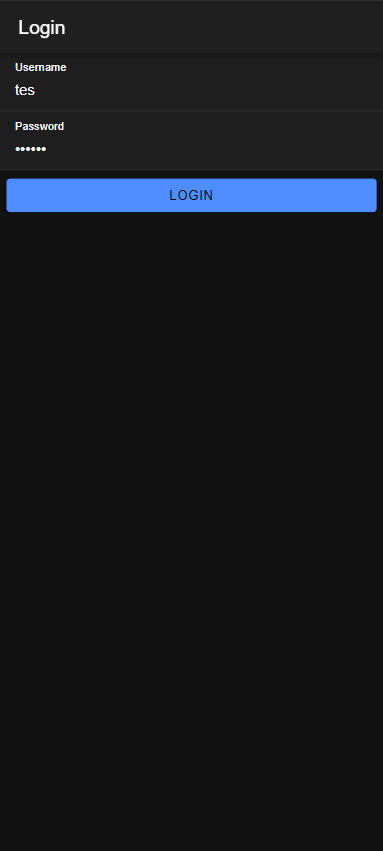
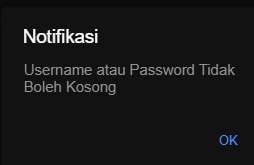
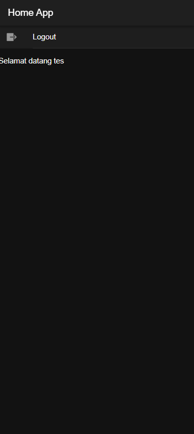

# Tugas 7 Praktikum Pemrograman Mobile

```yml
Nama: Panky Bintang Pradana Yosua
NIM: H1D022077
Shift Baru: F
Shift Lama: D
```

## Table of Contents

- [Tugas 7 Praktikum Pemrograman Mobile](#tugas-7-praktikum-pemrograman-mobile)
  - [Table of Contents](#table-of-contents)
  - [1. Routing](#1-routing)
    - [1.1 Spesifikasi Routing](#11-spesifikasi-routing)
    - [1.2 Auth Guard \> Login](#12-auth-guard--login)
    - [1.3 Auth Guard \> Home](#13-auth-guard--home)
  - [2. Login](#2-login)
    - [2.1 Halaman Login](#21-halaman-login)
    - [2.2 Login Handler](#22-login-handler)
    - [2.3 Proses Setelah Klik Button Login](#23-proses-setelah-klik-button-login)
  - [3. Home](#3-home)
    - [3.1 Halaman Home](#31-halaman-home)
    - [3.2 Home Handler dan Proses setelah klik Button Logout](#32-home-handler-dan-proses-setelah-klik-button-logout)

## 1. Routing

### 1.1 Spesifikasi Routing

Halaman yang akan dirender pertama kali oleh aplikasi adalah `/` atau root. Namun, ketika mengakses halaman tersebut, user akan diredirect/diteruskan ke halaman `/login`. Halaman login menggunakan `module login`.

```ts
const routes: Routes = [
  {
    path: "home",
    loadChildren: () => import("./home/home.module").then((m) => m.HomePageModule),
    canActivate: [authGuard],
  },
  {
    path: "",
    redirectTo: "login",
    pathMatch: "full",
  },
  {
    path: "login",
    loadChildren: () => import("./login/login.module").then((m) => m.LoginPageModule),
    canActivate: [autoLoginGuard],
  },
];
```

### 1.2 Auth Guard > Login

Jika user sudah `login`, maka akan diarahkan ke halaman `/home`. Jika belum `login`, maka akan tetap berada di halaman `login`.

```ts
export const autoLoginGuard: CanActivateFn = (route, state) => {
  const authService = inject(AuthenticationService);
  const router = inject(Router);

  return authService.authenticationState.pipe(
    filter((val) => val !== null),
    take(1),
    map((isAuthenticated) => {
      if (isAuthenticated) {
        router.navigateByUrl("/home", { replaceUrl: true });
        return true;
      } else {
        return true;
      }
    })
  );
};
```

### 1.3 Auth Guard > Home

Pada konfigurasi routing, modul `home` memiliki guard berupa Home Guard. Jika state user bernilai `false` (yang mana berarti `user` belum `login`), maka akan diarahkan ke halaman `login`, jika bernilai `true` akan tetap berada di halaman `home`.

Berikut adalah Guard nya:

```ts
export const authGuard: CanActivateFn = (route, state) => {
  const authService = inject(AuthenticationService);
  const router = inject(Router);

  return authService.authenticationState.pipe(
    filter((val) => val !== null),
    take(1),
    map((isAuthenticated) => {
      if (isAuthenticated) {
        return true;
      } else {
        router.navigateByUrl("/login", { replaceUrl: true });
        return true;
      }
    })
  );
};
```

## 2. Login

### 2.1 Halaman Login

Karena halaman `login` menggunakan modul `login`, modul `login` memiliki `declaration` bernama `LoginPage` yang makan declaration tersebut memiliki halaman `html login`. Halaman ini berisi UI `login`

Halaman `Login` dirender oleh kode html pada file `src\app\login\login.page.html`. Di Halaman login, terdapat 3 tombol input, 2 dengan jenis input text 1 input button.

Berikut adalah kodenya.

```html
<ion-header [translucent]="true">
  <ion-toolbar>
    <ion-title>Login</ion-title>
  </ion-toolbar>
</ion-header>

<ion-content [fullscreen]="true">
  <ion-header collapse="condense">
    <ion-toolbar>
      <ion-title size="large">Login</ion-title>
    </ion-toolbar>
  </ion-header>

  <ion-item lines="full">
    <ion-label position="floating">Username</ion-label>
    <ion-input type="text" [(ngModel)]="username" required="required"></ion-input>
  </ion-item>
  <ion-item lines="full">
    <ion-label position="floating">Password</ion-label>
    <ion-input type="password" [(ngModel)]="password" required="required"></ion-input>
  </ion-item>
  <ion-row>
    <ion-col>
      <ion-button type="submit" color="primary" expand="block" (click)="login()">Login</ion-button>
    </ion-col>
  </ion-row>
</ion-content>
```



### 2.2 Login Handler

Field yang ada pada halaman `login` dihandle oleh atribut yang dimiliki oleh `LoginPage`, yaitu `username`, dan `password`. Semua field memiliki validasi `required`, sehingga perlu diisi. Untuk submit dengan menekan tombol `Login`. Button ini akan mentrigger fungsi `login()` pada `LoginPage`.

```ts
@Component({
  selector: "app-login",
  templateUrl: "./login.page.html",
  styleUrls: ["./login.page.scss"],
})
export class LoginPage implements OnInit {
  username: any;
  password: any;
  constructor(private authService: AuthenticationService, private router: Router) {}

  ngOnInit() {}

  login() {
    if (this.username != null && this.password != null) {
      const data = {
        username: this.username,
        password: this.password,
      };
      this.authService.postMethod(data, "login.php").subscribe({
        next: (res) => {
          console.log({ res });
          if (res.status_login == "berhasil") {
            this.authService.saveData(res.token, res.username);
            this.username = "";
            this.password = "";
            this.router.navigateByUrl("/home");
          } else {
            this.authService.notifikasi("Username atau Password Salah");
          }
        },
        error: (e) => {
          this.authService.notifikasi("Login Gagal Periksa Koneksi Internet Anda");
        },
      });
    } else {
      this.authService.notifikasi("Username atau Password Tidak Boleh Kosong");
    }
  }
}
```

### 2.3 Proses Setelah Klik Button Login

Jika username atau password kosong, maka memunculkan pop up Notifikasi dengan pesan `Username atau Password Tidak Boleh Kosong`.



Jika berhasil maka melakukan fetch data user ke API, lalu mencocokkan data. Jika username atau password salah, maka muncul notifikasi `Username atau Password Salah`, jika terdapat error maka pesan yang diberikan adalah `Login Gagal Periksa Koneksi Internet Anda`.

Namun, jika berhasil akan menyimpan data user secara temporal, menyimpan state `isAuthenticated` menjadi `true` dan diarahkan ke halaman `/home`.

## 3. Home

### 3.1 Halaman Home

Halaman home merupakan modul dari `home`. Modul ini memiliki `declaration` berupa `HomePage`. `HomePage` memiliki halaman `html/template` yaitu `html home`.

Halaman `Home` dirender oleh kode html pada file `src\app\home\home.page.html`.

```html
<ion-header [translucent]="true">
  <ion-toolbar>
    <ion-title> Home App </ion-title>
  </ion-toolbar>
</ion-header>

<ion-content [fullscreen]="true">
  <ion-header collapse="condense">
    <ion-toolbar>
      <ion-title size="large">Home App</ion-title>
    </ion-toolbar>
  </ion-header>

  <ion-item (click)="logout()">
    <ion-icon slot="start" ios="exit-outline" md="exit-sharp"></ion-icon>
    <ion-label>Logout</ion-label>
  </ion-item>
  <hr />
  Selamat datang {{ nama }}
</ion-content>
```



Di halaman ini terdapat pesan `Selamat Datang {nama user}` serta tombol `Logout` untuk keluar dari aplikasi. Jika tombol `Logout` diklik akan mentrigger fungsi `logout` pada class `HomePage`.

### 3.2 Home Handler dan Proses setelah klik Button Logout

Fungsi ini akan mengubah state `isAuthenticated` menjadi `false` dan menghapus data autentikasi. Setelah itu diarahkan ke halaman login karena tidak memenuhi kondisi pada Home Guard.

```ts
@Component({
  selector: "app-home",
  templateUrl: "home.page.html",
  styleUrls: ["home.page.scss"],
})
export class HomePage {
  nama = "";
  constructor(private authService: AuthenticationService, private router: Router) {
    this.nama = this.authService.nama;
  }

  ngOnInit() {}

  logout() {
    this.authService.logout();
    this.router.navigateByUrl("/login");
  }
}
```
